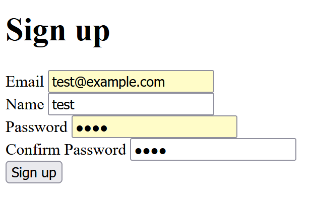
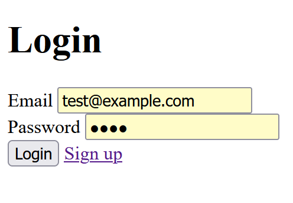
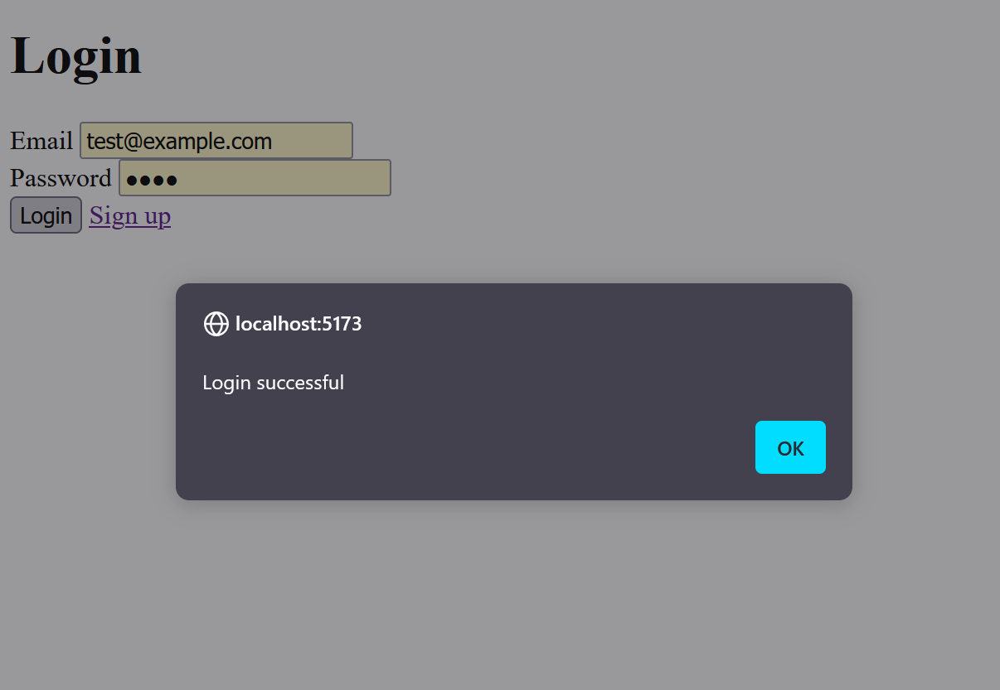

Recently, I learned about [Drizzle](https://orm.drizzle.team/), a new ORM for TypeScript. It occurred to me that it would be interesting to try it out with SvelteKit to build a fullstack application entirely in TypeScript.

This article will just cover the basics of setting up a project with SvelteKit and Drizzle, but here is one of my project (WIP) built with this stack: [review-planner](https://github.com/jywang99/review-planner).

As a simple example, this post will cover how to implement a user registration and login workflow with JWT authentication in a SvelteKit application. The source code (with some modifications) can be found here: [svelte-jwt-example](https://github.com/jywang99/svelte-jwt-example).

These are the steps:
1. Setting up the project
2. Initializing the database
3. Setting up the development environment
4. Implementing a simple user login workflow

## Create the project

First, create a new SvelteKit project, and install dependencies ([Official tutorial](https://svelte.dev/docs/kit/creating-a-project)).
```bash
npx sv create svelte-jwt
cd svelte-jwt
npm install
```

These are the selected options:
```
◇  Which template would you like?
│  SvelteKit minimal
│
◇  Add type checking with Typescript?
│  Yes, using Typescript syntax
│
◆  Project created
│
◇  What would you like to add to your project? (use arrow keys / space bar)
│  sveltekit-adapter, drizzle
│
◇  sveltekit-adapter: Which SvelteKit adapter would you like to use?
│  node
│
◇  drizzle: Which database would you like to use?
│  PostgreSQL
│
◇  drizzle: Which PostgreSQL client would you like to use?
│  Postgres.JS
│
◇  drizzle: Do you want to run the database locally with docker-compose?
│  Yes
│
◇  Which package manager do you want to install dependencies with?
│  npm
```

## Set up the development environment

### Config file

There should be a `.env.example` file in the root directory, generated during project creation. Rename it to `.env`.

> [!NOTE]
> I like to use `.env` file directly for my development environment for simplicity, since I deploy my stuff on k8s, and the `.env` file content will be overwritten by environment variables defined in the deployment.
>
> Feel free to use other profiles like `.env.dev`, etc.

### Database

In the installation process, Drizzle automatically creates a docker compose file, which spins up a PostgreSQL database.

Additionally, there should be some `npm` commands defined in `package.json` for database operations.
```json
	"scripts": {
		"db:start": "docker compose up",
		"db:push": "drizzle-kit push",
		"db:migrate": "drizzle-kit migrate",
		"db:studio": "drizzle-kit studio"
	},
```

So to start the database, run:
```bash
npm run db:start
```

There is a browser-based user interface that comes with Drizzle, which can be launched like this:
```bash
npm run db:studio
```
It will be available at [https://local.drizzle.studio/](https://local.drizzle.studio/).

### Development server

To start the development server, run:
```bash
npm run dev
```

## Define the database schema

This section is about creating the database schema in SvelteKit, and pushing it to the database. Refer to the [Drizzle documentation](https://orm.drizzle.team/docs/sql-schema-declaration) for more information.

First, define the schema in SvelteKit. To do that, find the file `src/lib/schema.ts` and add the following:
```typescript
import { type InferSelectModel } from "drizzle-orm";
import { pgTable, serial, text } from "drizzle-orm/pg-core";

export const user = pgTable("user", {
  id: serial("id").primaryKey(),
  email: text("email").unique().notNull(),
  name: text("name").notNull(),
  password: text("password").notNull(),
});

export type UserRow = InferSelectModel<typeof user>;
```

Then, push the schema to the database:
```bash
npm run db:push
```

This will create the `user` table in database.

## Implement the user registration route

The registration route will consist of a simple frontend with an HTML form, and a backend endpoint to handle the form submission.

Everything will be under `src/routes/register`.

### Frontend

```svelte
<!-- src/routes/register/+page.svelte -->

<script lang="ts">
  import { goto } from "$app/navigation";

  async function handleSubmit(event: SubmitEvent) {
    // prevent default behavior of form submission (page reload with query string params)
    event.preventDefault();

    const form = event.target;
    if (form == null || !(form instanceof HTMLFormElement)) {
      return;
    }
    const formData = new FormData(form);

    // ensure passwords match
    const pass = formData.get('password') as string;
    const confPass = formData.get('confirmPassword') as string;
    if (pass !== confPass) {
      alert('Passwords do not match');
      return;
    }

    // send a POST request to the current route
    const resp = await fetch(window.location.pathname, {
      method: 'POST',
      headers: {
        'Content-Type': 'application/json',
      },
      body: JSON.stringify({
        email: formData.get('email'),
        name: formData.get('name'),
        password: formData.get('password'),
      }),
    });

    if (!resp.ok) {
      alert('Failed to sign up');
      return;
    }

    goto('/auth/login');
  }
</script>

<h1>Sign up</h1>
<form on:submit={handleSubmit}>
  <label for="email">Email</label>
  <input type="email" id="email" name="email" required />
  <br />

  <label for="name">Name</label>
  <input type="text" id="name" name="name" required />
  <br />

  <label for="password">Password</label>
  <input type="password" id="password" name="password" required />
  <br />

  <label for="confirmPassword">Confirm Password</label>
  <input type="password" id="confirmPassword" name="confirmPassword" required />
  <br />

  <button type="submit">Sign up</button>
</form>
```


### Backend

```typescript
// src/routes/register/+server.ts

import { db } from "$lib/server/db";
import { user } from "$lib/server/db/schema";
import type { RequestEvent } from "./$types";

// request body type
type RegistReq = {
  email: string;
  name: string;
  password: string;
}

// handling POST /api/regist
export async function POST({ request }: RequestEvent) {
  const body = await request.json() as RegistReq;

  // TODO validation

  // insert user
  await db.insert(user).values({
    email: body.email,
    password: body.password,
    name: body.name
  });

  // respond with 201 Created
  return new Response(null, { status: 201 });
}
```

## Implement login route

This will be another HTML form and a backend endpoint in the same manner, contained in `src/routes/auth/login`.

### Frontend

```svelte
<!-- src/routes/auth/login/+page.svelte -->

<script lang="ts">
  async function handleSubmit(event: SubmitEvent) {
    event.preventDefault();

    const form = event.target as HTMLFormElement;
    const formData = new FormData(form);

    const email = formData.get("email");
    const password = formData.get("password");

    const resp = await fetch("/auth/login", {
      method: "POST",
      headers: {
        "Content-Type": "application/json",
      },
      body: JSON.stringify({ email, password }),
    });

    if (!resp.ok) {
      alert("Failed to login");
      return;
    }
    alert("Login successful");
  }
</script>

<h1>Login</h1>

<form on:submit={handleSubmit}>
  <label for="email">Email</label>
  <input type="email" id="email" name="email" required />
  <br />

  <label for="password">Password</label>
  <input type="password" id="password" name="password" required />
  <br />

  <button type="submit">Login</button>
  <a href="/auth/regist">Sign up</a>
</form>
```


### Backend

```typescript
import { db } from "$lib/server/db";
import { user } from "$lib/server/db/schema";
import { eq } from 'drizzle-orm';
import type { RequestEvent } from "./$types";

type LoginReq = {
  email: string;
  password: string;
}

export async function POST({ request }: RequestEvent) {
  const body = await request.json() as LoginReq;

  const dbUsers = await db.select()
    .from(user)
    .where(eq(user.email, body.email))
    .limit(1);
  if (dbUsers.length === 0) {
    return new Response(null, { status: 401 });
  }
  const dbUser = dbUsers[0];

  if (dbUser.password !== body.password) {
    return new Response(null, { status: 401 });
  }

  return new Response(JSON.stringify({
    name: dbUser.name,
    email: dbUser.email
  }), { status: 200 });
}
```

## Conclusion

Now the simple registration and login form should be working. Navigate to [http://localhost:3000/auth/regist](http://localhost:3000/auth/regist) to test it out.

Once registered, you should be taken to the login screen, and be able to log in.



