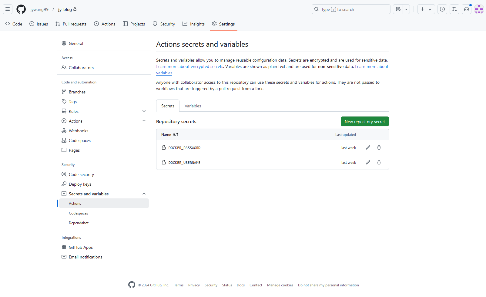
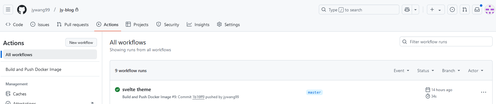

[GitHub Actions](https://github.com/features/actions) is a convenient way to automate your CI/CD workflow. Personally I'm using it to build and push docker images to [Docker Hub](https://hub.docker.com/) for a few of my projects, and in this post I will share a simple example of how to set it up.

## Prerequisites
1. A GitHub repository with a Dockerfile
2. A Docker Hub account (or any other container registry)

> [!NOTE]
> If using a different docker registry than Docker Hub, you will need to change the login action in the workflow file. \
> See [docs](https://docs.docker.com/build/ci/github-actions/copy-image-registries/) for more information.

## Step 1: Generate a Personal Access Token

For [DockerHub](https://hub.docker.com/), 
1. Go to [Docker Hub](https://hub.docker.com/) and log in.
2. Click on your profile icon in the top right corner, then click on `Account Settings`.
3. Click "Personal access tokens", then "Generate new token"
4. Give the token a name like "github", and give it both `read` and `write` permissions.

## Step 2: Create a manifest file

Create a new file `.github/workflows/docker-build.yml` in your repository with the following content: \
Here I'm using `${{ secrets.DOCKER_USERNAME }}/blog` as an example (it's this blog). You can replace it with your own repository name.

```yaml
name: Build and Push Docker Image

on:
  push:
    branches:
      # TODO: change this to your main branch name(s)
      - master

env:
  # TODO: replace with your own repository name
  DOCKER_REPO: ${{ secrets.DOCKER_USERNAME }}/blog

jobs:
  build:
    runs-on: ubuntu-latest

    steps:
      # Checkout the repository code
      - name: Checkout code
        uses: actions/checkout@v3
        with:
          submodules: true

      # Log in to Docker Hub
      - name: Log in to Docker Hub
        uses: docker/login-action@v2
        with:
          username: ${{ secrets.DOCKER_USERNAME }}
          password: ${{ secrets.DOCKER_PASSWORD }}

      # Set date tag as a variable
      - name: Set date tag
        run: echo "DATE_TAG=$(date +'%Y%m%d')" >> $GITHUB_ENV

      # Build the Docker image with both tags
      - name: Build Docker image
        run: docker build -t $DOCKER_REPO:release -t $DOCKER_REPO:$DATE_TAG .

      # Push both tags to Docker Hub
      - name: Push Docker image
        run: docker push $DOCKER_REPO:release && docker push $DOCKER_REPO:$DATE_TAG
```

This is the file that GitHub Actions will look for to run your workflow. The file name can be anything, but the directory must be `.github/workflows/`.

In this example, every time a change is pushed to `master` branch, the action will generate two tags:
1. `release`
2. `YYYYMMDD` (the date of the build)

## Step 3: Add secrets to your repository

Go to your repository on GitHub, then click on `Settings` > `Secrets` > `New repository secret`.



Then add two secrets as shown in the image:
1. `DOCKER_USERNAME`: your Docker Hub username
2. `DOCKER_PASSWORD`: the personal access token you generated in step 1

## Step 4: Push your changes
Now it's time to push your changes to GitHub.

Once you do, you can go to the `Actions` tab in your repository to see the action "in action".



That's it! Now you should see a new docker image being pushed for every change you make to your repository.

