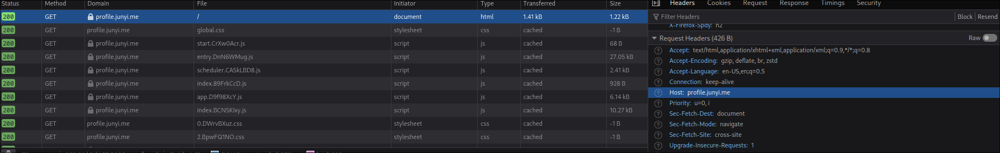

Just a few days after I set up my k3s cluster with an external data source, I found this article [High Availability Embedded etcd](https://docs.k3s.io/datastore/ha-embedded) on k3s' official website. Since the external database was the single point of failure in my previous setup, I was excited to try this out.

This time, in addition to setting up the cluster itself, I also set up `metal-lb` for load balancing and `cert-manager` for enabling HTTPS. So this is basically everything I've done to set up a k3s cluster from several vanilla Debian 12 VMs. The physical machines and VMs haven't changed from [my previous attempt](https://blog.junyi.me/post/setup-k3s-cluster-home/).

References
1. https://docs.k3s.io/datastore/ha-embedded
2. https://www.youtube.com/watch?v=G4CmbYL9UPg&t=1892s

## Set up the nodes
First things first, let's set up our master nodes.

To be able to communicate between nodes (for all masters and workers), we need to generate a token to pass to all nodes. In my case I used `openssl` to generate one.
```bash
openssl rand -base64 64
```
The output should look like this:
```
c8eDnRlzm/wnsvk/86gxQsx55MiLfQndLvINqoyFlmFX+utnbVZVFZbiXFpMyMfV
AGX005ruzShxOGaaIGL+/w==
```
Don't worry about the linebreak, and just use the entire string as token.

Once the token is ready, we can use it with the installation script plus a few options to install and launch k3s on the first master node.
```bash
curl -sfL https://get.k3s.io | K3S_TOKEN="c8eDnRlzm/wnsvk/86gxQsx55MiLfQndLvINqoyFlmFX+utnbVZVFZbiXFpMyMfVAGX005ruzShxOGaaIGL+/w==" sh -s - server \
	--cluster-init \
	--node-ip=192.168.1.2 \

```
Options
1. `--cluster-init` tells k3s to use embedded `etcd` as data source
2. `--node-ip`: specify the IP address to use for inter-node communication (my VM has multiple IPs)
If your master node only has one IP, you can safely omit the `--node-ip` option.

After the script finishes, confirm the node is up and running by
```bash
sudo kubectl get node
```
which should output something like this:
```
NAME        STATUS   ROLES                       AGE    VERSION
kmaster01   Ready    control-plane,etcd,master   135m   v1.30.6+k3s1
```

If it looks good, we can proceed to join the second master node to the cluster.
```bash
curl -sfL https://get.k3s.io | K3S_TOKEN="c8eDnRlzm/wnsvk/86gxQsx55MiLfQndLvINqoyFlmFX+utnbVZVFZbiXFpMyMfVAGX005ruzShxOGaaIGL+/w==" sh -s - server \
    --server https://192.168.1.2:6443 \
	--node-ip=192.168.1.3
```

And join the third master node.
```bash
curl -sfL https://get.k3s.io | K3S_TOKEN="c8eDnRlzm/wnsvk/86gxQsx55MiLfQndLvINqoyFlmFX+utnbVZVFZbiXFpMyMfVAGX005ruzShxOGaaIGL+/w==" sh -s - server \
    --server https://192.168.1.2:6443 \
	--node-ip=192.168.1.7
```

Confirm the results by running on any node:
```bash
sudo kubectl get node
```
If all three nodes show up, we now have a 3-node k3s cluster. 🥳
```
NAME        STATUS   ROLES                       AGE    VERSION
kmaster01   Ready    control-plane,etcd,master   150m   v1.30.6+k3s1
kmaster02   Ready    control-plane,etcd,master   142m   v1.30.6+k3s1
kmaster03   Ready    control-plane,etcd,master   141m   v1.30.6+k3s1
```

{}
The number of master nodes should be an odd number, as stated in [the official guide](https://docs.k3s.io/datastore/ha-embedded)
{}

If you have a non-standard network setup, take some time to verify that the `kubectl` command works on all master nodes, and also make sure to check the pods in `kube-system` cluster are running properly.
```
$ kubectl get pod -n kube-system
NAME                                      READY   STATUS      RESTARTS   AGE
coredns-7b98449c4-kfckn                   1/1     Running     0          154m
helm-install-traefik-crd-d5llv            0/1     Completed   0          154m
helm-install-traefik-nj5wm                0/1     Completed   2          154m
local-path-provisioner-595dcfc56f-d2mcw   1/1     Running     0          154m
metrics-server-cdcc87586-vhj44            1/1     Running     0          154m
traefik-d7c9c5778-7mwhl                   1/1     Running     0          153m
```

Now that everything looks good, we can join our worker nodes to the cluster. To do that, just run the following command on all nodes that you want to configure as worker nodes:
```bash
curl -sfL https://get.k3s.io | K3S_URL=https://192.168.1.2:6443 K3S_TOKEN="c8eDnRlzm/wnsvk/86gxQsx55MiLfQndLvINqoyFlmFX+utnbVZVFZbiXFpMyMfVAGX005ruzShxOGaaIGL+/w==" sh -
```
FYI: you can use any of the three master nodes here.

Confirm that the worker nodes have joined successfully with `sudo kubectl get node`
```
NAME        STATUS   ROLES                       AGE    VERSION
kmaster01   Ready    control-plane,etcd,master   3h2m   v1.30.6+k3s1
kmaster02   Ready    control-plane,etcd,master   175m   v1.30.6+k3s1
kmaster03   Ready    control-plane,etcd,master   174m   v1.30.6+k3s1
kwork01     Ready    <none>                      156m   v1.30.6+k3s1
kwork02     Ready    <none>                      158m   v1.30.6+k3s1
kwork03     Ready    <none>                      157m   v1.30.6+k3s1
kwork04     Ready    <none>                      156m   v1.30.6+k3s1
kwork06     Ready    <none>                      155m   v1.30.6+k3s1
```

{}
Node name refers to the hostname of each node. To change it, just change the hostname.
{}

## Control k3s remotely
The `kubectl` command doesn't have to be ran from the master nodes. To control k3s from another machine, all we have to do is to install `kubectl` package and put the `.kube/config` file in place.

I'm using Arch (btw) on my primary PC, so I'll just do
```bash
sudo pacman -S kubectl
```
For debian-based distros, do
```bash
sudo apt install kubectl
```
for other distros/OSes, refer https://kubernetes.io/docs/tasks/tools/

By default, `kubectl` assumes the control plane runs on localhost, so we have to point it to one of the master nodes. To do that, go to one of the master nodes and do
```bash
sudo cp /etc/rancher/k3s/k3s.yaml .kube/config
```
This will allow you to run `kubectl` without `sudo` on that master node. Confirm it's working, and then copy the config file to the machine you want to control k3s from. Example (on my primary PC):
```bash
mkdir ~/.kube
scp k3s:~/.kube/config ~/.kube/config
```
Now you should be able to run `kubectl` directly from your workstation.

From this point I will use the command `kc` a lot, which I've aliased to `kubectl`. Feel free to do the same.

## Install helm charts
Helm is a package manager for kubernetes add-ons. Here is how to install it on debian-based distros:
```bash
curl https://baltocdn.com/helm/signing.asc | gpg --dearmor | sudo tee /usr/share/keyrings/helm.gpg > /dev/null
sudo apt-get install apt-transport-https --yes
echo "deb [arch=$(dpkg --print-architecture) signed-by=/usr/share/keyrings/helm.gpg] https://baltocdn.com/helm/stable/debian/ all main" | sudo tee /etc/apt/sources.list.d/helm-stable-debian.list
sudo apt-get update
sudo apt-get install helm
```
Refer to https://helm.sh/docs/intro/install/ for details.

Using Helm, we want to install two things:
1. [`metal-lb`](https://metallb.universe.tf/): "a load-balancer implementation for bare metal Kubernetes clusters", to set up load balancing without any cloud provider solutions
2. [`cert-manager`](https://cert-manager.io/): "X.509 certificate management for Kubernetes and OpenShift", to manage obtaining and renewing SSL certificates for us

Let's start by installing `metallb`.
```bash
helm repo add metallb https://metallb.github.io/metallb
helm repo update
helm install metallb metallb/metallb --namespace metallb-system --create-namespace
```

This creates a namespace called `metallb-system`, and deploy pods to all nodes for handling load balancing. Example:
```
$ kc get daemonsets.apps --all-namespaces
NAMESPACE        NAME              DESIRED   CURRENT   READY   UP-TO-DATE   AVAILABLE   NODE SELECTOR            AGE
metallb-system   metallb-speaker   8         8         8       8            8           kubernetes.io/os=linux   3h10m
$ kc get pod -n metallb-system
NAME                                  READY   STATUS    RESTARTS   AGE
metallb-controller-77cb7f5d88-vz5q9   1/1     Running   0          3h9m
metallb-speaker-4dpdz                 4/4     Running   0          3h9m
metallb-speaker-cqm56                 4/4     Running   0          3h9m
metallb-speaker-gtrzs                 4/4     Running   0          3h9m
metallb-speaker-j5zgf                 4/4     Running   0          175m
metallb-speaker-lr8sv                 4/4     Running   0          175m
metallb-speaker-n64dm                 4/4     Running   0          178m
metallb-speaker-nh6rm                 4/4     Running   0          175m
metallb-speaker-x2s28                 4/4     Running   0          176m
```

For `cert-manager`, start by defining resource type `certificate` by using an official release yml file
```bash
kubectl apply -f https://github.com/cert-manager/cert-manager/releases/download/v1.16.1/cert-manager.crds.yaml
```

{}
Be sure to update the version (v1.16.1 in the above example) to the latest available one
{}

If installed successfully, you should see no error with this command:
```
$ kc get certificate
No resources found in default namespace.
```

Then we will install `cert-manager` with `helm`:
```bash
helm repo add jetstack https://charts.jetstack.io --force-update
helm install cert-manager jetstack/cert-manager --namespace cert-manager --create-namespace --values=cert-mgr-values.yml --version v1.16.1
```

{}
Use the same version as above
{}

`cert-mgr-values.yml`:
```yml
installCRDs: false
replicaCount: 1
extraArgs:
  - --dns01-recursive-nameservers=1.1.1.1:53,9.9.9.9:53
  - --dns01-recursive-nameservers-only
podDnsPolicy: None
podDnsConfig:
  nameservers:
    - 1.1.1.1
    - 9.9.9.9
```
This is telling `helm` not to install CRD (custom resource definition), since we have done it already (the certificate resource type). The [video tutorial](https://www.youtube.com/watch?v=G4CmbYL9UPg&t=1892s) by [Techno Tim](https://www.youtube.com/@TechnoTim) explains this in detail.

You should now see three pods in the `cert-manager` namespace.
```
$ kc get pod -n cert-manager
NAME                                       READY   STATUS    RESTARTS   AGE
cert-manager-6fd7ddf84c-4ll84              1/1     Running   0          3h5m
cert-manager-cainjector-7895f6ff5c-7ww4g   1/1     Running   0          3h5m
cert-manager-webhook-5d7fc67f7b-hw75r      1/1     Running   0          3h5m
```

## Configure metallb
To use `metal-lb` as our load balancer, we need to tell it the IP range it can listen on. Ideally this IP range should not be handed out by DHCP. By running it in [Layer 2 mode](https://metallb.universe.tf/concepts/layer2/), `metal-lb` will respond to ARP requests to the specified IPs our nodes, so that the requests to those IPs are routed to the cluster.
```bash
kc apply -f network/metallb-config.yml
```

`network/metallb-config.yml`:
```yml
apiVersion: metallb.io/v1beta1
kind: IPAddressPool
metadata:
  name: pool
  namespace: metallb-system
spec:
  addresses:
  - 192.168.1.100-192.168.1.200
---
apiVersion: metallb.io/v1beta1
kind: L2Advertisement
metadata:
  name: l2-advertisement
  namespace: metallb-system
spec:
  ipAddressPools:
  - pool
```

At this point, we would want to disable the default `klipper` load balancer, and let `metal-lb` handle everything. To do that, we need to add an argument to the k3s startup command. Do the following for each master node:
```bash
sudo systemctl edit k3s
```

Under the initial block of comments, add this:
```
[Service]
ExecStart=
ExecStart=/usr/local/bin/k3s \
    server \
    --node-ip 192.168.1.2 \
    --disable servicelb
```
This will override the original command, and disable `klipper` after restarting the k3s service.

Restart k3s to reflect changes
```bash
sudo systemctl restart k3s
```

Remember to do this for all of your master nodes.

After the restart, you should now see only one daemon set created by `metal-lb`
```
$ kc get daemonsets.apps --all-namespaces
NAMESPACE        NAME              DESIRED   CURRENT   READY   UP-TO-DATE   AVAILABLE   NODE SELECTOR            AGE
metallb-system   metallb-speaker   8         8         8       8            8           kubernetes.io/os=linux   3h46m
```

Also, check the external IP address that is assigned to the `traefik` service in `kube-system` namespace. if you don't like it, you can edit the service.
```
$ kc get service -n kube-system
NAME             TYPE           CLUSTER-IP      EXTERNAL-IP   PORT(S)                      AGE
kube-dns         ClusterIP      10.43.0.10      <none>        53/UDP,53/TCP,9153/TCP       4h47m
metrics-server   ClusterIP      10.43.214.104   <none>        443/TCP                      4h47m
traefik          LoadBalancer   10.43.156.158   192.168.1.101 80:31801/TCP,443:30190/TCP   4h46m
```

## Deploy a website
Now that we have our load balancer and certificate manager ready, it's time to deploy something. Here, I will use my own personal website as an example.

First, create a namespace and deploy the pod, service, and ingress
```bash
kc create namespace myself
kc apply -f myself.yml
```
`myself.yml`:
```yml
apiVersion: apps/v1
kind: Deployment
metadata:
  name: myself-deployment
  namespace: myself
  labels:
    app: myself
spec:
  replicas: 1
  selector:
    matchLabels:
      app: myself
  template:
    metadata:
      labels:
        app: myself
    spec:
      containers:
      - name: myself-front
        image: jyking99/myself:release
        imagePullPolicy: Always
        ports:
          - containerPort: 3000

---

apiVersion: v1
kind: Service
metadata:
  name: myself-service
  namespace: myself
spec:
  selector:
    app: myself
  ports:
  ports:
  - protocol: TCP
    port: 3000
    targetPort: 3000

---

apiVersion: networking.k8s.io/v1
kind: Ingress
metadata:
  name: verse-ingress
  namespace: myself
  annotations:
    spec.ingressClassName: traefik
spec:
  rules:
    - host: profile.junyi.me
      http:
        paths:
        - path: /
          pathType: Prefix
          backend:
            service:
              name: myself-service
              port:
                number: 3000
  tls:
    - hosts:
        - "*.junyi.me"
      secretName: junyi-me-production
```
The domains `profile.junyi.me` and `*.junyi.me` are my domains that I registered on [Cloudflare](https://www.cloudflare.com/). Replace them with your own domain.

with the `ingress` resource configured, `traefik` will now redirect any traffic to its load balancer external IP to your service, based the value of the `Host` header, which is automatically added by browsers.


## From internet to cluster
Usually, at this point, you would want to point your DNS A record to your home router, and configure a port forwarding from your router to the load balancer IP of `traefik` service.

However, since I don't have the control over my router at the place I live, I had to resort to a workaround of using SSH remote port forwarding. It is a bit slow for larger files, but so far it's working fine for my personal website and this blog.

To set it up, we need two things: 
1. A VM on the cloud - I'm going with [Amazon EC2](https://aws.amazon.com/ec2/), but any cloud provider would work
2. A stable SSH connection to that VM

First, set up the cloud VM of your choice. Make sure to open ports 80 and 443 on the firewall and the VM itself. \
Once that's done, update/add the DNS A record of your domain to point to the public IP address of the VM. \
Then, you can use the image [jyking99/ssh-forward](https://hub.docker.com/repository/docker/jyking99/ssh-forward/general) to set up a SSH reverse port forward, to route traffic from the publicly available server to your cluster.

Set up port forwarding for HTTP and HTTPS
```bash
kc create namespace network # you can customize this
kc apply -f ssh-forward.yml
```

`ssh-forward.yml`:
```yml
apiVersion: apps/v1
kind: Deployment
metadata:
  name: sfwd-http
  namespace: network
  labels:
    app: sfwd-http
spec:
  replicas: 1
  selector:
    matchLabels:
      app: sfwd-http
  template:
    metadata:
      labels:
        app: sfwd-http
    spec:
      containers:
      - name: sfwd-http
        image: jyking99/ssh-forward:latest
        env:
        - name: REMOTE_HOST
          value: "<host_of_cloud_vm>"
        - name: REMOTE_PORT
          value: "80"
        - name: LOCAL_HOST
          value: "192.168.1.101"
        - name: LOCAL_PORT
          value: "80"
        volumeMounts:
        - name: sfwd-config
          mountPath: /data
      volumes:
      - name: sfwd-config
        configMap:
          name: sfwd-cm

---

apiVersion: apps/v1
kind: Deployment
metadata:
  name: sfwd-https
  namespace: network
  labels:
    app: sfwd-https
spec:
  replicas: 1
  selector:
    matchLabels:
      app: sfwd-https
  template:
    metadata:
      labels:
        app: sfwd-https
    spec:
      containers:
      - name: sfwd-https
        image: jyking99/ssh-forward:latest
        env:
        - name: REMOTE_HOST
          value: "<host_of_cloud_vm>"
        - name: REMOTE_PORT
          value: "443"
        - name: LOCAL_HOST
          value: "192.168.1.101"
        - name: LOCAL_PORT
          value: "443"
        volumeMounts:
        - name: sfwd-config
          mountPath: /data
      volumes:
      - name: sfwd-config
        configMap:
          name: sfwd-cm

---

apiVersion: v1
kind: ConfigMap
metadata:
  name: sfwd-cm
  namespace: network
data:
  identity: |
	<your_private_key>
  known_hosts: |
	<your_known_hosts_file>
```

Now let's check if we can access the website. Just open your browser and type in your domain name. Note that we haven't configured HTTPS yet, so if you use HTTPS, there should be a certificate warning. Aside from that, you should be presented with your website hosted in your own cluster.

Take a moment to admire your beautiful website, and then we'll proceed to get rid of that warning screen or the broken padlock that's been bothering you.

## Enable HTTPS
To enable HTTPS, we have to supply two things to the `cert-manager`:
1. the email address that you used to register for domain
2. an API token that grants permission to edit the domain information (for Cloudflare, here is the guide: https://developers.cloudflare.com/fundamentals/api/get-started/create-token/)

I used [Let's Encrypt](https://letsencrypt.org/) to generate my certificate, but feel free to use other certificate authorities.

Once you've got the token, toss it in the yml file below, and apply it
```bash
kc apply -f secret-cf-token.yaml
```
`secret-cf-token.yaml`:
```yml
apiVersion: v1
kind: Secret
metadata:
  name: cloudflare-token-secret
  namespace: cert-manager
type: Opaque
stringData:
  cloudflare-token: <token>
```

Then we'll tell `cert-manager` about our certificate authority (Let's Encrypt)
```bash
kc apply -f letsencrypt-staging.yml
```
`letsencrypt-staging.yml`:
```yml
apiVersion: cert-manager.io/v1
kind: ClusterIssuer
metadata:
  name: letsencrypt-production
  namespace: cert-manager
spec:
  acme:
    server: https://acme-v02.api.letsencrypt.org/directory
    email: <email>
    privateKeySecretRef:
      name: letsencrypt-production
    solvers:
      - dns01:
          cloudflare:
            email: <email>
            apiTokenSecretRef:
              name: cloudflare-token-secret
              key: cloudflare-token
        selector:
          dnsZones:
            - "<your_domain>"
```

Then in the namespace of the website, apply the following to start a DNS-01 challenge
```bash
kc apply -f your-domain-production.yml
```
`your-domain-production.yml`:
```yml
apiVersion: cert-manager.io/v1
kind: Certificate
metadata:
  name: your-domain-prod
spec:
  secretName: your-domain-production
  issuerRef:
    name: letsencrypt-production
    kind: ClusterIssuer
  commonName: "<your_domain>"
  dnsNames:
  - "<your_domain>"
  # you can specify multiple subdomains, and/or wildcard subdomains
```

This might take some time, since `cert-manager` has to wait for the DNS record to propagate. You can follow the log of `cert-manager` to see status.
```
E1112 21:51:45.063113       1 sync.go:208] "propagation check failed" err="DNS record for \"junyi.me\" not yet propagated" logger="cert-manager.controller" resource_name="junyi-me-prod-1-35532540-1088611370" resource_namespace="myself" resource_kind="Challenge" resource_version="v1" dnsName="junyi.me" type="DNS-01"
```
It will complain like this for a while, and finally, when you see a log like this, the DNS challenge has succeeded
```
I1112 22:27:35.980150       1 acme.go:236] "certificate issued" logger="cert-manager.controller.sign" resource_name="junyi-me-prod-1" resource_namespace="verse" resource_kind="CertificateRequest" resource_version="v1" related_resource_name="junyi-me-prod-1-35532540" related_resource_namespace="verse" related_resource_kind="Order" related_resource_version="v1"
```

{}
This has to be done every time you want to deploy a web service in a new namespace, since the generated certificate is only visible in one namespace. Ingress resources in the same namespace can share the same certificate.
{}

With all of these done, you should now be able to access your domain in your browser without any warning. Moment of truth... \
If everything worked, congratulations! 🥳🥳🥳 You have successfully self-hosted a website. 

## Conclusion
As a software engineer, I had written quite a lot of code for web services, including front-end, back-end, CLI runners, and so on. But deploying them to test environment and production environment were rarely my job (especially production), and a lot of it seemed like magic to me. Setting up this home lab environment was a step towards demystifying that process, and I feel like I'm learning a lot just by following tutorials and resolving the issues I encountered along the way.

At the moment, I have some thoughts on improving this setup, for example:
1. Set up DDNS on the cloud VM, just in case the public IP changes
2. Set up a DNS failover for the master nodes, so that if one node goes down, I can automatically use the remaining ones for `kubectl`

but these are for another time.

