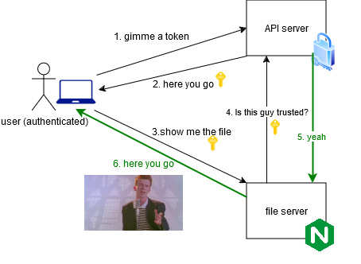
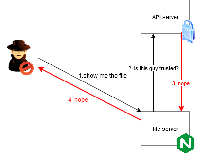

## The problem

In a recent project, there was a need to serve some static files from a NFS share.

Initially I served everything directly from a backend API server written with [Go Echo framework](https://echo.labstack.com/), but it soon turned into a nightmare with all the path concatenations and partial content serving (mainly for large video files).

The reason behind serving files from the API server was authentication. I didn't want to expose any files to the public without proper authentication, even if the URLs are randomized or changed frequently. \
These are the approaches that I saw on a lot of places on the internet, but they all fall under the category of **security through obscurity**, which is not a good practice.

## The solution

After spending some time surfing the internet, I found this: [ngx_http_auth_request_module](http://nginx.org/en/docs/http/ngx_http_auth_request_module.html). \
tl;dr: this module allows you to use Nginx to serve static files, but handle authentication with a different server.

This was exactly what I needed!

Essentially, an authenticated user can access the file: \
 \
But unauthenticated user cannot: \


The key point is that Nginx will forward the authentication headers/cookies to the API server, making it possible to keep the authentication logic on the API server.

## Implementation

Nice, but how do we do that?

Well, turns out it's not that hard. A few lines in the Nginx configuration file was all it took.
> [!INFO]
> Implementing authentication in the API server is out of scope for this post.

### Step 1: Ensure the module is available

First, make sure the module is available in your Nginx installation.
```bash
nginx -V 2>&1 | grep -o with-http_auth_request_module
# should show "with-http_auth_request_module"
```

If you are using [the official docker image](https://hub.docker.com/_/nginx) like I do, it is enabled by default (as of tag `nginx:bookworm`).

### Step 2: Configure Nginx

In the example below, authentication is required for all files served from the root directory `/mnt/data`.

```apacheconf
# /etc/nginx/conf.d/default.conf

server {
  listen       80;
  listen  [::]:80;
  server_name  _;

  root /mnt/data;

  # Authentication is required for all files
  location / {
    auth_request /auth-content;
  }

  # Auth subrequest for other directories
  location /auth-content {
    internal;
    proxy_pass http://api.example.com/auth/content$request_uri; # change this

    # forward headers to the API server
    proxy_set_header Content-Type application/json;
    proxy_set_header X-Original-URI $request_uri;
    proxy_set_header X-Original-Method $request_method;
  }
}
```

With this, Nginx authenticate send a subrequest to the API server for every request it receives.

### That's it!

It was surprising to me how easy it is to set this up, and I had never had an issue with it since.

### An example

Lastly, I will leave an example configuration here, which is close to what I use in my Kubernetes cluster.

```apacheconf
proxy_cache_path /tmp/nginx_cache levels=1:2 keys_zone=auth_cache:10m max_size=100m inactive=60m use_temp_path=off;

server {
  listen       80;
  listen  [::]:80;
  server_name  _;

  root /mnt/data;

  location / {
    auth_request /auth-content;
  }

  location /thumb {
    auth_request /auth-thumb;
  }

  # Auth subrequest for thumbgen directory
  location /auth-thumb {
    internal;
    proxy_pass http://api-server-service.example.svc.cluster.local:80/auth-media/thumb;

    # Enable caching for this location
    proxy_cache auth_cache;  # Use the defined cache zone
    proxy_cache_valid 200 1h;  # Cache 200 responses for 1 hour
    proxy_cache_use_stale error timeout updating;  # Use stale cached content in case of error or timeout
    proxy_cache_background_update on;  # Update the cache in the background
    add_header X-Cache-Status $upstream_cache_status;  # Add a header to show cache status (optional)

    proxy_set_header Content-Type application/json;
    proxy_set_header X-Original-URI $request_uri;
    proxy_set_header X-Original-Method $request_method;
  }

  # Auth subrequest for other directories
  location /auth-content {
    internal;
    proxy_pass http://api-server-service.example.svc.cluster.local:80/auth-media/content$request_uri;

    # Enable caching for this location
    proxy_cache auth_cache;  # Use the defined cache zone
    proxy_cache_valid 200 1h;  # Cache 200 responses for 1 hour
    proxy_cache_use_stale error timeout updating;  # Use stale cached content in case of error or timeout
    proxy_cache_background_update on;  # Update the cache in the background
    add_header X-Cache-Status $upstream_cache_status;  # Add a header to show cache status (optional)

    proxy_set_header Content-Type application/json;
    proxy_set_header X-Original-URI $request_uri;
    proxy_set_header X-Original-Method $request_method;
  }

  # Liveness/Readiness probe path - no authentication
  location = /healthz {
    access_log off;
    return 200 'OK';
    add_header Content-Type text/plain;
  }

  add_header 'Access-Control-Allow-Origin' '*' always;
  add_header 'Access-Control-Allow-Headers' '*' always;
  add_header 'Access-Control-Allow-Methods' 'GET, POST, OPTIONS' always;
}
```

