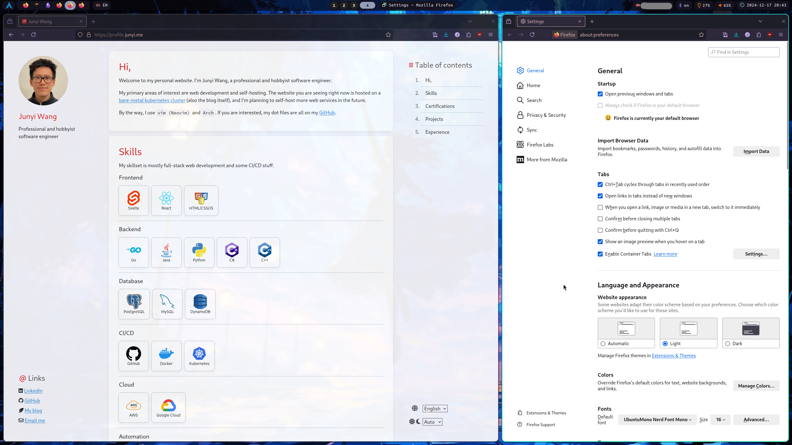
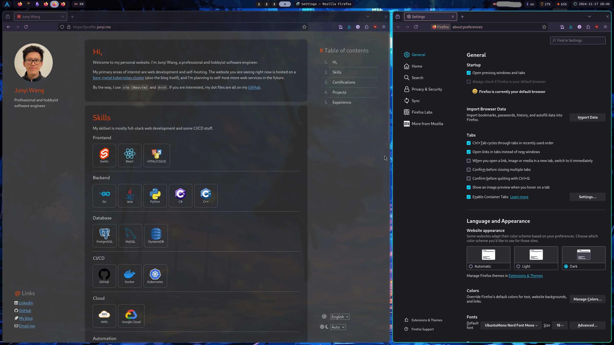

Most websites nowadays have light mode, dark mode, and a system adaptive mode. It's pretty trivial to implement this in Svelte.

In this post I will use [my personal website](https://profile.junyi.me/) as an example to show how to implement this feature.

> [!NOTE]
> This is an update to the [original post on the same topic]()

## Demo



## Implementation

There are three parts to this implementation:
1. CSS
2. Svelte component
3. Svelte store

The git repository for this project is public, and can be found [here](https://github.com/jywang99/myself).

### CSS
Create a global css file if you don't have one already. I named it `global.css`, and imported it in `app.html`.

Inside, place the following CSS blocks:

```css
/* global.css */

/* light mode style variables */
[data-scheme='light'] {
    --bg-1: hsl(0, 0%, 100%);
    --bg-2: #f5f5fa;
    --bg-3: hsl(206, 20%, 80%);
    --bg-4: #edf1f5;
    --fg-1: hsl(0, 0%, 13%);
    --fg-2: hsl(0, 0%, 20%);
    --fg-3: hsl(0, 0%, 30%);

    --highlight: #ffffcc;
    --accent: #E2211C;

    --link: hsl(208, 77%, 47%);
    --link-hover: hsl(208, 77%, 55%);
    --link-active: hsl(208, 77%, 40%);
}

/* dark mode style variables */
[data-scheme='dark'] {
    --bg-1: hsl(0, 0%, 18%);
    --bg-2: #3f3f3f;
    --bg-3: hsl(0, 0%, 40%);
    --fg-1: hsl(0, 0%, 90%);
    --fg-2: hsl(0, 0%, 70%);
    --fg-3: hsl(0, 0%, 60%);

    --highlight: #4c4c3c;
    --accent: #ff4500;

    --link: hsl(206, 96%, 72%);
    --link-hover: hsl(206, 96%, 78%);
    --link-active: hsl(206, 96%, 64%);
}
```

These CSS variables will be only accessible in other html, css, or svelte files if the `data-scheme` attribute is set to the corresponding value.

### Svelte store

Next, we need a Svelte store to keep track of the user's preference. Here, `localstorage` is used to persist the preference.

```ts
// stores.ts

import { writable, type Writable } from 'svelte/store';

// Possible theme options
export type ThemeType = 'light' | 'dark' | 'auto';

// Preference store: any other preference can be added here
export type PrefType = {
  theme: ThemeType;
}

// Store type: this is the object that will be stored in localstorage
export type StoreType = {
  pref: PrefType;
}

// Initialize the store
const stored = localStorage.content;
const store: Writable<StoreType> = writable(stored ? JSON.parse(stored) : {
  pref: {
    theme: 'auto',
  }
});

store.subscribe(value => {
  localStorage.content = JSON.stringify(value);
});

export default store;
```

### Svelte component

Finally, create a Svelte component to let user select the color theme.

The gist is to use `prefers-color-scheme` [media query](https://developer.mozilla.org/en-US/docs/Web/CSS/CSS_media_queries/Testing_media_queries) to detect the user's system preference. If the user selects a specific theme from dropdown, it will override the system preference.

> [!INFO]
> For the dropdown component, I created my own with i18n support. The code is available [here](https://github.com/jywang99/myself), but any dropdown component will work.

```svelte
<!-- Preference.svelte -->

<script lang="ts">
  import Card from "$lib/Card.svelte";
  import { onDestroy } from "svelte";
  import store, { type ThemeType } from "./stores";
  import Dropdown from "./Dropdown.svelte";

  let { onConfirm = () => {} }: { onConfirm?: () => void; } = $props();

  const switchColor = (dark: boolean) => {
    if (dark) {
      document.documentElement.dataset.scheme = 'dark';
    } else {
      document.documentElement.dataset.scheme = 'light';
    }
  };

  const mediaQuery = window.matchMedia('(prefers-color-scheme: dark)');
  let switchFn: ((e: MediaQueryListEvent) => void) | null = null;

  const switchTheme = (theme: ThemeType) => {
    if (theme === 'auto') {
      // Add the listener only if it doesn't exist
      if (!switchFn) {
        switchFn = (e: MediaQueryListEvent) => switchColor(e.matches);
        mediaQuery.addEventListener('change', switchFn);
      }
      // Set the initial color based on current preference
      switchColor(mediaQuery.matches);
      return;
    }

    // Remove the listener if switching to a specific theme
    if (switchFn) {
      mediaQuery.removeEventListener('change', switchFn);
      switchFn = null;
    }
    // Manually set the theme
    switchColor(theme === 'dark');
  };

  // Subscribe to store changes
  const unsubscribe = store.subscribe(store => {
    // theme
    const theme = store.pref.theme;
    switchTheme(theme);
  });

  // Cleanup on component destroy
  onDestroy(() => {
    if (switchFn) {
      mediaQuery.removeEventListener('change', switchFn);
    }
    unsubscribe();
  });

  // Theme options
  type themeOptType = { value: ThemeType, txLabel: string };
  let themeOptions: themeOptType[] = [
    { value: 'light', txLabel: 'pref.colorTheme.light' },
    { value: 'dark', txLabel: 'pref.colorTheme.dark' },
    { value: 'auto', txLabel: 'pref.colorTheme.auto' },
  ];

</script>

<!--...-->
<Dropdown bind:selected={$store.pref.theme} options={themeOptions} onChange={onConfirm} />
<!--...-->
```

### Main html file update

There are two things to do in the main html file, `app.html`:
1. add the `global.css` stylesheet
2. add a script to detect the user's system preference

The reason to add the script in the `<header>` is to set the color theme before the page is rendered. This will **prevent the page from flickering when first loaded**, which was the problem in the original post.

```html
<!-- app.html -->

<!doctype html>
<html lang="en">
<head>
    <meta charset="utf-8" />
    <link rel="icon" href="%sveltekit.assets%/favicon.png" />

    <!-- Add global css -->
    <link rel="stylesheet" href="%sveltekit.assets%/css/global.css" />

    <meta name="viewport" content="width=device-width, initial-scale=1" />
    %sveltekit.head%

    <!-- set the color scheme variable before page render -->
    <script>
      (function() {
        // Check localStorage for theme
        const pref = JSON.parse(localStorage.getItem('content') || '{}').pref || {}; // TODO: adjust this to your store structure
        const theme = pref.theme || 'auto';

        if (theme === 'dark' || (theme === 'auto' && window.matchMedia('(prefers-color-scheme: dark)').matches)) {
          document.documentElement.dataset.scheme = 'dark';
        } else {
          document.documentElement.dataset.scheme = 'light';
        }
      })();
    </script>

</head>
<body data-sveltekit-preload-data="hover">
    <div style="display: contents">%sveltekit.body%</div>
</body>
</html>
```

