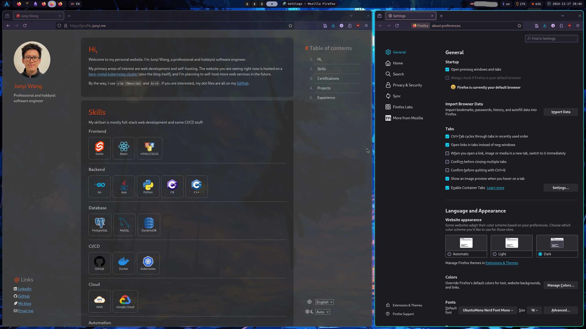

Most websites nowadays have light mode, dark mode, and a system adaptive mode. It's pretty trivial to implement this in Svelte.

In this post I will use [my personal website](https://profile.junyi.me/) as an example to show how to implement this feature.

## Demo



## Implementation
For now, I am just using a single `Preference.svelte` component to manage all the user-specific persistent settings for my personal website.

```svelte
<!-- Preference.svelte -->

<script lang="ts">
  import Card from "$lib/Card.svelte";
  import { onDestroy } from "svelte";
  import store, { type ThemeType } from "./stores";
  import Dropdown from "./Dropdown.svelte";

  let { onConfirm = () => {} }: { onConfirm?: () => void; } = $props();

  const switchColor = (dark: boolean) => {
    if (dark) {
      document.body.classList.add('dark');
    } else {
      document.body.classList.remove('dark');
    }
  };

  const mediaQuery = window.matchMedia('(prefers-color-scheme: dark)');
  let switchFn: ((e: MediaQueryListEvent) => void) | null = null;

  const switchTheme = (theme: ThemeType) => {
    if (theme === 'auto') {
      // Add the listener only if it doesn't exist
      if (!switchFn) {
        switchFn = (e: MediaQueryListEvent) => switchColor(e.matches);
        mediaQuery.addEventListener('change', switchFn);
      }
      // Set the initial color based on current preference
      switchColor(mediaQuery.matches);
      return;
    }

    // Remove the listener if switching to a specific theme
    if (switchFn) {
      mediaQuery.removeEventListener('change', switchFn);
      switchFn = null;
    }
    // Manually set the theme
    switchColor(theme === 'dark');
  };

  // Subscribe to store changes
  const unsubscribe = store.subscribe(store => {
    // theme
    const theme = store.pref.theme;
    switchTheme(theme);
  });

  // Cleanup on component destroy
  onDestroy(() => {
    if (switchFn) {
      mediaQuery.removeEventListener('change', switchFn);
    }
    unsubscribe();
  });

  // Theme options
  type themeOptType = { value: ThemeType, txLabel: string };
  let themeOptions: themeOptType[] = [
    { value: 'light', txLabel: 'pref.colorTheme.light' },
    { value: 'dark', txLabel: 'pref.colorTheme.dark' },
    { value: 'auto', txLabel: 'pref.colorTheme.auto' },
  ];

</script>

<!--...-->
<Dropdown bind:selected={$store.pref.theme} options={themeOptions} onChange={onConfirm} />
<!--...-->
```

Essentially, it is using the `prefers-color-scheme` [media query](https://developer.mozilla.org/en-US/docs/Web/CSS/CSS_media_queries/Testing_media_queries) to detect the user's system preference. If the user selects a specific theme, it will override the system preference.

For persistence, I'm simply using a Svelte store with localstorage.

```ts
// stores.ts

import { writable, type Writable } from 'svelte/store';

export type ThemeType = 'light' | 'dark' | 'auto';
export type PrefType = {
  theme: ThemeType;
}
export type StoreType = {
  pref: PrefType;
}

const stored = localStorage.content;
const store: Writable<StoreType> = writable(stored ? JSON.parse(stored) : {
  pref: {
    dark: 'auto',
  }
});

store.subscribe(value => {
  localStorage.content = JSON.stringify(value);
});

export default store;
```

