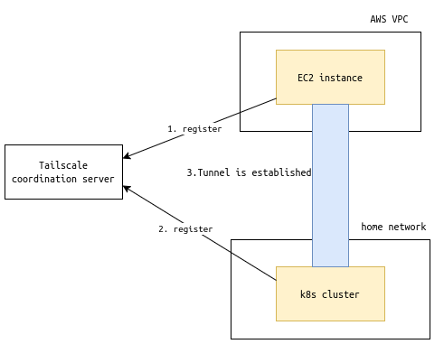
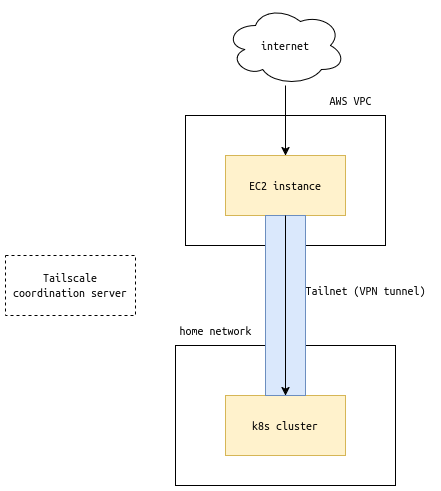
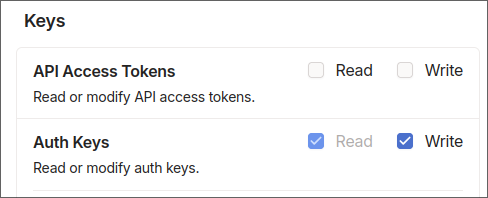
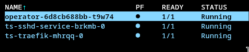
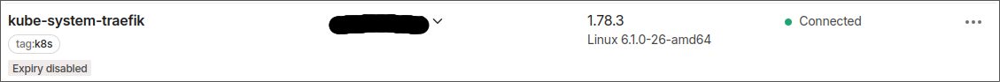

Self-hosting requires exposing services ran locally to the internet. Typically this is done through port forwarding on the router on an on-site router, but this has several concerns:
1. **Security**: It requires ports on your private network to be exposed to the internet.
2. **Dynamic IPs**: If your ISP changes your IP, you need to update your DNS records.
3. **Household limitations**: If you live in a shared household, you might not have access to the router.

[Tailscale](https://tailscale.com/) is a VPN solution that constructs a mesh network between multiple devices without punching holes in your firewalls, and therefore does not require a public IP. In this way, it solves all the concerns mentioned above.

This post will show you how to combine EC2, Tailscale, and `iptables` to expose services on a kubernetes cluster to the internet. \
I used EC2 because I'm familiar with it, but feel free to use any other cloud provider.

## Conceptual overview

First, the EC2 instance and kubernetes cluster both need to be registered to the same Tailscale network.



Once the registration is complete, devices can communicate with each other through the Tailscale network without having to go through any external service (More information about Tailscale can be found [here](https://tailscale.com/blog/how-tailscale-works)).



On the EC2 instance, we will use `iptables` to forward traffic from the public-facing NIC to the Tailscale virtual NIC.

## Setting up a publically accessible VM

Set up a VM on your cloud provider of choice. I used **Debian 12**, but any other popular distro should work as well.

Remember to open ports for your specific port-forwarding needs (not necessary for Tailscale itself). This is done through **Security Groups** if using AWS.

## Setting up Tailscale network

Refer this official guide: [How to Secure Kubernetes Access with Tailscale](https://tailscale.com/learn/managing-access-to-kubernetes-with-tailscale) to set up a Tailscale network, and register the EC2 instance and the kubernetes cluster to the same network.

> [!WARNING]
> As of writing, the documentation is not up-to-date. \
> When setting up the OAuth client, the doc says to only select "Devices: Read/Write", but you also need to select **"Auth Keys: Read/Write"**.
> 

Within the guide, I found the method: [Exposing a Kubernetes Service Using the Operator](https://tailscale.com/learn/managing-access-to-kubernetes-with-tailscale#exposing-a-kubernetes-service-using-the-operator) to be most suited for the use case of this post. By using this, the Tailscale Operator will automatically find services with a certain annotation, and expose the service to the Tailscale network.

For example, I added annotations for an ssh bastion service and a traefik service:


The services will show up in the Tailscale admin console like this:


## Port-forwarding with iptables

By following above guide, you should have set up a Tailscale network, and confirmed that services on the kubernetes cluster can be accessed within the Tailscale network.

Now, it's time for the last piece of the puzzle: port-forwarding.

Log in to the EC2 instance, and run the following commands:
```shell
sudo iptables -t nat -A PREROUTING -p tcp --dport <source_port> -j DNAT --to-destination <service_IP>:<destination_port>
# add more rules like above for additional port forwarding...
sudo iptables -t nat -A POSTROUTING -j MASQUERADE
```
Confirm the rules:
```shell
sudo iptables -t nat -L
```
You should see the port-forwarding rules in the chain: `Chain PREROUTING`, and a rule for `MASQUERADE` in the chain: `Chain ts-postrouting`.

Example:
```
Chain PREROUTING (policy ACCEPT)
target     prot opt source               destination
DNAT       tcp  --  anywhere             anywhere             tcp dpt:http to:<traefik_IP>:80
DNAT       tcp  --  anywhere             anywhere             tcp dpt:https to:<traefik_IP>:443

...

Chain ts-postrouting (0 references)
target     prot opt source               destination
MASQUERADE  all  --  anywhere             anywhere             mark match 0x40000/0xff0000
```

## Done!

Now you should be able to access your services using the public IP of the EC2 instance. 🥳

In my case, since I was doing this for http/https port forwarding, and already had a DNS record on Cloudflare pointing to the public IP of my EC2 instance ([junyi.me](https://junyi.me/)), I confirmed everything was working by simply visiting the domain.

